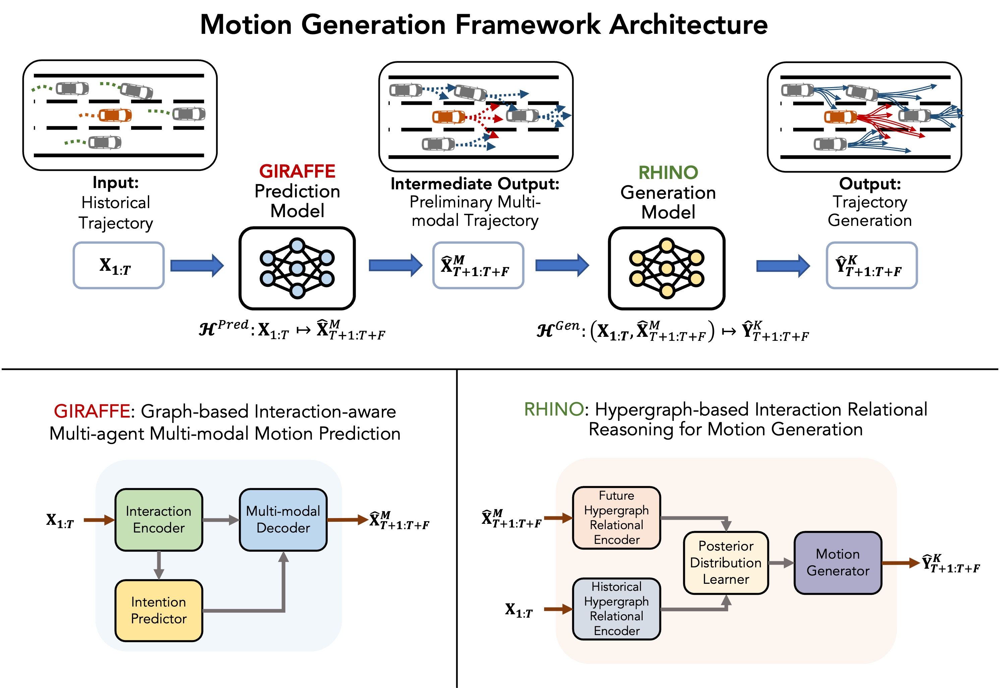
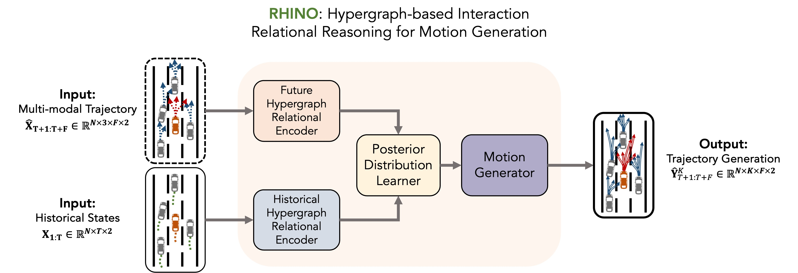
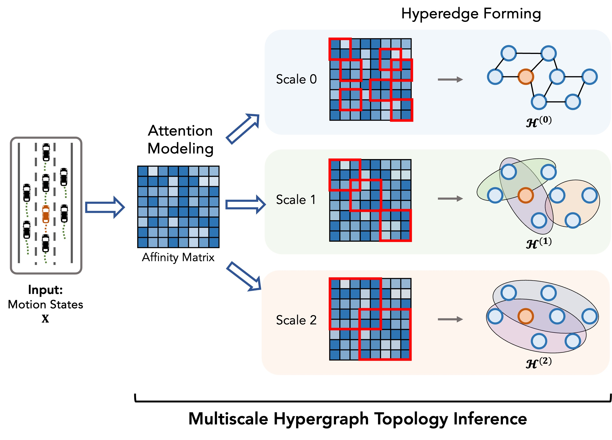
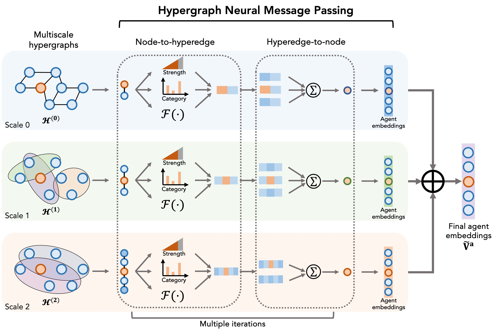
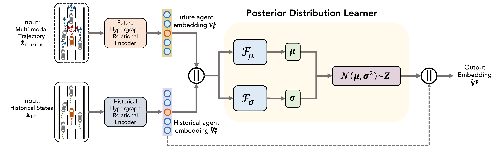
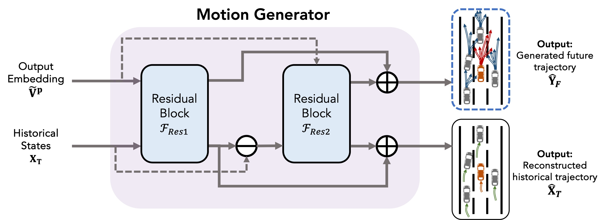
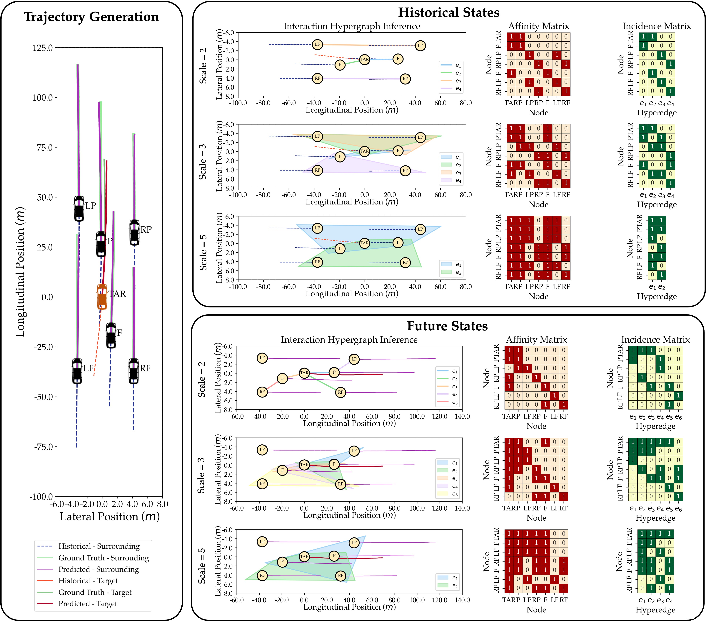

# RHINO: Hypergraph-based Motion Generation with Multi-modal Interaction & Relational Reasoning

**RHINO** is a two-stage framework for **multi-agent, multi-modal motion prediction** that performs explicit **group-wise relational reasoning**. It couples a graph-based predictor (**GIRAFFE**) with a **multi-scale hypergraph** encoder and a **CVAE**-driven generator to produce diverse, socially consistent futures.

> 📄 Paper (preprint): *Hypergraph-based Motion Generation with Multi-modal Interaction Relational Reasoning*  
> 💻 Code: https://github.com/keshuw95/RHINO-Hypergraph-Motion-Generation

---

## Highlights

- Introduces **RHINO** for hypergraph-based, multi-agent, multi-modal motion prediction with explicit relational reasoning.  
- Captures **group-wise interactions** via a **multi-scale hypergraph** that models joint influence.  
- Uses an **agent–behavior graph** to disentangle the multi-modality of driving behaviors.  
- Performs **intention-conditioned reasoning** over hyperedges.  
- Learns **higher-order interaction patterns** and yields **human-interpretable explanations**.  
- Delivers **accurate multi-future trajectory predictions** with an **efficient residual decoder**.

---

## Framework at a Glance

RHINO is organized as **predict → reason → generate**:

1) **GIRAFFE (Predict)**  
   Learns pairwise interactions and outputs **multi-modal candidate futures** for all agents. It expands each agent into **behavior nodes** (e.g., L/K/R) to keep modes disentangled.

2) **RHINO (Reason & Generate)**  
   Lifts candidates into **multi-scale hypergraphs** (hyperedges = groups), performs **intention-conditioned message passing**, and uses a **CVAE** with a **residual decoder** to sample **K** plausible futures per scene.

  

---

## Why Hypergraphs (vs. pairwise graphs)?

Real traffic is often **many-to-many**: a single maneuver can induce coordinated responses across several vehicles and lanes. Pairwise graphs approximate this with multiple edges; **hypergraphs** encode it **directly** as one hyperedge connecting the whole group.

- **Many-to-many influence:** one hyperedge models a coordinated behavior.  
- **Multi-scale context:** small groups (gap acceptance) → larger platoons (shockwave propagation).  
- **Cleaner reasoning:** messages flow through group contexts rather than ad-hoc pairwise mixing.

---

## Core Components

### 1) GIRAFFE: Graph-based Multi-modal Predictor
- **Interaction encoder:** DGCN over forward/backward transitions for asymmetric, multi-hop influence.  
- **Intention head:** L/K/R with **feasibility masks**.  
- **Multi-modal decoder:** GRU+MLP yields per-mode trajectory distributions.  
- **Agent–Behavior Graph:** Expands each agent into behavior nodes to prevent “mode averaging.”

> Output: multi-agent, multi-modal candidates \(\hat{\mathbf{X}}_{T+1:T+F}^{M}\) + intention probabilities.

### 2) Multi-scale Hypergraph Relational Encoder
- **Topology inference:** Builds **S** hypergraph scales by grouping agents with high trajectory-affinity.  
- **Node→Hyperedge→Node** message passing with:
  - **Neural interaction strength** per hyperedge,  
  - **Gumbel-softmax interaction type** selection (intention-conditioned),  
  - **Per-type MLPs** capturing motifs (cooperative merge, competitive cut-in, platooning).  
- **Outputs:** scale-stacked embeddings encoding both **fine** (pairwise) and **coarse** (group) dynamics.

  
  

### 3) Posterior Distribution Learner (CVAE)
- Learns a **latent space** \( \mathbf{Z} \) for stochastic futures given history + candidates.  
- **ELBO** training balances reconstruction fidelity and calibrated uncertainty.  
- At inference, sample \( \mathbf{Z} \) to draw **K** diverse, plausible trajectories.

  

### 4) Residual Motion Generator
- Two **residual** GRU+MLP blocks:
  - **Block 1:** initial past reconstruction + coarse future.  
  - **Block 2:** refinement using reconstruction residuals (stabilizes long horizons).  
- Produces **K** futures per agent; enforces temporal smoothness and physical plausibility.

  

---

## Intention-Conditioned Reasoning

- The agent–behavior graph provides **mode-specific nodes** per agent.  
- RHINO conditions hyperedge reasoning on **predicted intentions** (e.g., neighbors’ L/K/R).  
- This aligns group messages with **maneuver combinations** likely to occur, avoiding “blurry” averages over incompatible futures.

---

## Interpretability by Design

RHINO exposes several **human-readable** artifacts:

- **Hyperedge polygons**: which vehicles grouped together at each scale.  
- **Affinity matrix (N×N)**: pairwise correlation structure.  
- **Incidence matrix (nodes×hyperedges)**: vehicle–group membership.  
- **Interaction types** (Gumbel-softmax): soft labels for motifs (yielding, zipper merges, platooning).  

These views help explain **why** a forecast was produced (and flag odd groupings).

  

---

## Repository Map (framework parts)

